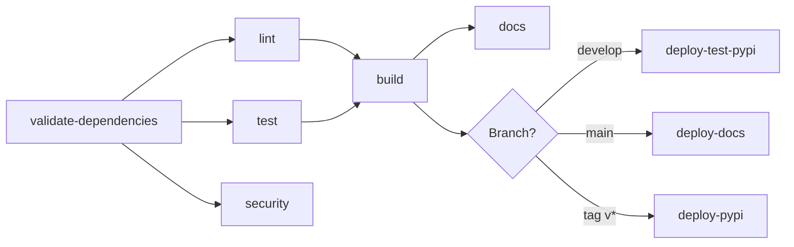

# CI/CD Pipeline Setup Guide

## Overview

This repository has a comprehensive CI/CD pipeline using GitHub Actions with dependency version consistency enforcement via `uv` lock files.

## Table of Contents

- [Quick Start](#quick-start)
- [Pipeline Architecture](#pipeline-architecture)
- [Dependency Management](#dependency-management)
- [Local Development Setup](#local-development-setup)
- [Branch Protection Rules](#branch-protection-rules)
- [Deployment Configuration](#deployment-configuration)
- [Troubleshooting](#troubleshooting)

## Quick Start

### 1. Generate Lock File

Before your first commit, generate the `uv.lock` file:

```bash
# Install uv if not already installed
curl -LsSf https://astral.sh/uv/install.sh | sh

# Generate lock file
uv lock

# Commit the lock file
git add uv.lock
git commit -m "chore: add uv.lock for dependency version consistency"
```

### 2. Install Pre-commit Hooks

```bash
# Install pre-commit
uv pip install pre-commit

# Install hooks
pre-commit install

# Test hooks (optional)
pre-commit run --all-files
```

### 3. Verify CI Pipeline

Push to a branch and create a PR to verify the CI pipeline runs successfully.

## Pipeline Architecture

The CI/CD pipeline consists of the following stages:



### Pipeline Stages

1. **validate-dependencies** (Critical)
   - Verifies `uv.lock` exists and is up to date
   - Checks for security vulnerabilities
   - Fails if lock file is missing or out of sync
   - **This ensures reproducible builds across all environments**

2. **lint**
   - Runs Ruff linter and formatter
   - Runs MyPy type checker (currently informational)
   - Ensures code quality standards

3. **test**
   - Matrix testing: Python 3.12, 3.13 on Ubuntu, macOS, Windows
   - Runs pytest with coverage reporting
   - Uploads coverage to Codecov
   - Excludes slow and GPU tests by default

4. **test-slow** (on main branch only)
   - Runs slow benchmark and integration tests
   - Only on pushes to main branch

5. **security**
   - Runs Bandit security linter
   - Runs Trivy vulnerability scanner
   - Uploads results to GitHub Security tab

6. **build**
   - Builds Python distribution packages (wheel and sdist)
   - Validates package metadata
   - Uploads artifacts for deployment

7. **docs**
   - Builds Sphinx documentation
   - Uploads HTML documentation as artifact

8. **deploy-docs** (main branch only)
   - Deploys documentation to GitHub Pages
   - Accessible at `https://imewei.github.io/quantiq`

9. **publish-test-pypi** (develop branch only)
   - Publishes to Test PyPI for validation
   - Uses trusted publishing (OIDC)

10. **publish-pypi** (tags only)
    - Publishes to production PyPI
    - Triggered by version tags (e.g., `v0.1.0`)

## Dependency Management

### The Problem: Version Drift

Without lock files, CI and local environments can have different dependency versions, leading to:
- "Works on my machine" issues
- Non-reproducible builds
- Security vulnerabilities from outdated dependencies
- Deployment failures

### The Solution: uv Lock Files

We use `uv.lock` to ensure **identical dependency versions** across:
- Local development
- CI/CD pipeline
- Production deployments
- Docker containers

### Lock File Workflow

#### Adding a New Dependency

```bash
# 1. Add to pyproject.toml
vim pyproject.toml  # Add dependency

# 2. Update lock file
uv lock

# 3. Install updated dependencies
uv sync

# 4. Commit both files
git add pyproject.toml uv.lock
git commit -m "chore(deps): add new-package"
```

#### Updating Dependencies

```bash
# Update all dependencies
uv lock --upgrade

# Update specific package
uv lock --upgrade-package numpy

# Install updated dependencies
uv sync --frozen

# Commit lock file
git add uv.lock
git commit -m "chore(deps): update dependencies"
```

#### Lock File Validation

The CI pipeline **automatically validates** that:
1. `uv.lock` exists
2. `uv.lock` is in sync with `pyproject.toml`
3. Dependencies install successfully

**If validation fails**, the pipeline stops immediately, preventing broken builds.

### Pre-commit Hook: Lock File Check

The pre-commit hook validates lock file consistency before every commit:

```bash
# Manually trigger
pre-commit run uv-lock-check --all-files

# Will fail with helpful message if out of sync:
# ❌ uv.lock is out of sync! Run: uv lock
```

## Local Development Setup

### Using uv (Recommended)

```bash
# Install uv
curl -LsSf https://astral.sh/uv/install.sh | sh

# Create virtual environment and install dependencies
uv sync

# Install development dependencies
uv sync --group dev

# Run tests
uv run pytest

# Run linter
uv run ruff check .

# Format code
uv run ruff format .
```

### Using Docker

```bash
# Development environment
docker-compose up dev

# Run tests in Docker
docker-compose run --rm test

# Jupyter notebook
docker-compose up jupyter
# Access at http://localhost:8888

# Build and serve docs
docker-compose up docs
# Access at http://localhost:8080
```

### Using Traditional pip (Not Recommended)

```bash
# Create virtual environment
python3.12 -m venv venv
source venv/bin/activate

# Install from lock file (requires uv)
uv pip install -r <(uv export --frozen)

# Or install editable
pip install -e ".[dev]"
```

## Branch Protection Rules

### Recommended Settings

Configure these at: **Settings → Branches → Branch protection rules**

#### For `main` branch:

- [x] Require pull request reviews before merging
  - Required approvals: 1
  - [x] Dismiss stale pull request approvals when new commits are pushed
  - [x] Require review from Code Owners

- [x] Require status checks to pass before merging
  - [x] Require branches to be up to date before merging
  - Required status checks:
    - `validate-dependencies`
    - `lint`
    - `test (3.12, ubuntu-latest)`
    - `security`
    - `build`
    - `all-checks-passed`

- [x] Require conversation resolution before merging

- [x] Require signed commits (optional but recommended)

- [x] Require linear history

- [x] Do not allow bypassing the above settings

#### For `develop` branch:

- [x] Require pull request reviews before merging
  - Required approvals: 1

- [x] Require status checks to pass before merging
  - Required status checks:
    - `validate-dependencies`
    - `test (3.12, ubuntu-latest)`
    - `build`

### CLI Setup (using gh CLI)

```bash
# Install GitHub CLI
brew install gh  # macOS
# or
sudo apt install gh  # Ubuntu

# Authenticate
gh auth login

# Create branch protection for main
gh api repos/imewei/quantiq/branches/main/protection \
  --method PUT \
  --input - <<EOF
{
  "required_status_checks": {
    "strict": true,
    "contexts": [
      "validate-dependencies",
      "lint",
      "test (3.12, ubuntu-latest)",
      "security",
      "build",
      "all-checks-passed"
    ]
  },
  "enforce_admins": true,
  "required_pull_request_reviews": {
    "dismissal_restrictions": {},
    "dismiss_stale_reviews": true,
    "require_code_owner_reviews": true,
    "required_approving_review_count": 1
  },
  "restrictions": null,
  "required_linear_history": true,
  "allow_force_pushes": false,
  "allow_deletions": false,
  "required_conversation_resolution": true
}
EOF
```

## Deployment Configuration

### GitHub Pages (Documentation)

1. Go to **Settings → Pages**
2. Source: **Deploy from a branch**
3. Branch: **gh-pages** / **root**
4. Save

Documentation will be available at: `https://imewei.github.io/quantiq`

### PyPI Publishing (Trusted Publishing)

#### Setup Test PyPI

1. Go to [Test PyPI](https://test.pypi.org/)
2. Account Settings → Publishing → Add a new pending publisher
   - PyPI Project Name: `quantiq`
   - Owner: `imewei`
   - Repository: `quantiq`
   - Workflow: `ci.yml`
   - Environment: `test-pypi`

#### Setup Production PyPI

1. Go to [PyPI](https://pypi.org/)
2. Account Settings → Publishing → Add a new pending publisher
   - PyPI Project Name: `quantiq`
   - Owner: `imewei`
   - Repository: `quantiq`
   - Workflow: `ci.yml`
   - Environment: `pypi`

#### Create GitHub Environments

1. Go to **Settings → Environments**
2. Create **test-pypi** environment
   - Deployment branches: `develop`
   - No additional protection rules needed
3. Create **pypi** environment
   - Deployment branches: Only protected branches
   - Required reviewers: Add yourself
   - Wait timer: 5 minutes (optional)

#### Publish to Test PyPI

```bash
git checkout develop
git push origin develop
```

#### Publish to Production PyPI

```bash
# Create and push a version tag
git tag -a v0.1.0 -m "Release v0.1.0"
git push origin v0.1.0
```

### Secrets Configuration

No secrets are needed for the current setup (using trusted publishing), but if needed:

```bash
# Add secrets via GitHub CLI
gh secret set CODECOV_TOKEN --body "your-token"

# Or via web UI:
# Settings → Secrets and variables → Actions → New repository secret
```

## Troubleshooting

### Lock File Out of Sync

**Error:**
```
❌ uv.lock is out of sync! Run: uv lock
```

**Solution:**
```bash
uv lock
git add uv.lock
git commit -m "chore: update uv.lock"
```

### Tests Failing Locally But Passing in CI

**Cause:** Different dependency versions

**Solution:**
```bash
# Ensure you're using locked dependencies
rm -rf .venv
uv sync --frozen
uv run pytest
```

### Pre-commit Hook Failures

**Skip hooks temporarily (not recommended):**
```bash
git commit --no-verify -m "message"
```

**Fix hooks:**
```bash
pre-commit run --all-files
git add .
git commit -m "fix: pre-commit issues"
```

### Docker Build Failures

**Clear cache and rebuild:**
```bash
docker-compose down -v
docker-compose build --no-cache
docker-compose up
```

### GitHub Actions Failing

1. Check the **Actions** tab for detailed logs
2. Look for the specific job that failed
3. Common issues:
   - Lock file missing: Run `uv lock` locally
   - Tests failing: Run `uv run pytest` locally
   - Security vulnerabilities: Check Dependabot alerts

### Dependabot Pull Requests

Dependabot will automatically create PRs for dependency updates.

**Review process:**
1. Check the PR for breaking changes
2. Review the changelog of updated packages
3. Ensure all CI checks pass
4. Merge if safe

**For major updates:**
```bash
# Test locally first
gh pr checkout 123
uv run pytest
# If tests pass, approve and merge
```

## Performance Optimization

### Cache Configuration

The pipeline uses several caching strategies:

1. **uv cache**: Caches Python packages
2. **GitHub Actions cache**: Caches dependencies between runs
3. **Docker layer cache**: Caches Docker build layers

### Parallel Execution

Tests run in parallel across multiple Python versions and operating systems:
- Python 3.12, 3.13
- Ubuntu, macOS, Windows

### Fail Fast

The pipeline uses `fail-fast: false` to run all test combinations even if one fails, providing complete test coverage information.

## Security Best Practices

1. **Lock files in version control**: Ensures reproducible builds
2. **Automated security scanning**: Bandit + Trivy
3. **Trusted publishing**: No API tokens needed
4. **Non-root Docker user**: Security-hardened containers
5. **Dependabot updates**: Automated dependency patches
6. **Code owners**: Required reviews for sensitive files
7. **Signed commits**: Verify commit authenticity (optional)

## Next Steps

1. [ ] Enable Codecov integration: https://codecov.io/
2. [ ] Set up branch protection rules
3. [ ] Configure GitHub Pages
4. [ ] Set up PyPI trusted publishing
5. [ ] Generate `uv.lock` file: `uv lock`
6. [ ] Install pre-commit hooks: `pre-commit install`
7. [ ] Create first PR to test the pipeline

## Support

For issues or questions:
- Check the [GitHub Actions documentation](https://docs.github.com/en/actions)
- Review the [uv documentation](https://github.com/astral-sh/uv)
- Open an issue in the repository

## Changelog

- **2025-10-20**: Initial CI/CD pipeline setup with uv lock file validation
